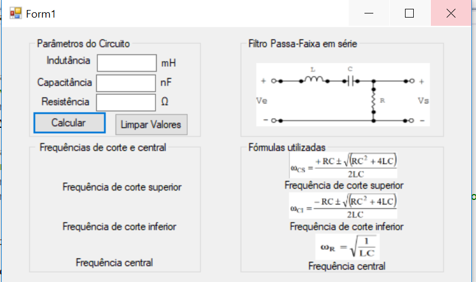

# Hans_Filtro_Passa_Faixa
Objetivo: Desenvolver o código capaz de reproduzir o comportamento de filtros comuns, como passa baixa.

Motivação do projeto: devido a normal contaminação de sinais nos microcontroladores de maneira geral, um filtro digital de sinais é cada vez mais necessário para a separação de sinais e a restauração do sinal.

Descrição do projeto: com o auxílio de algoritmos computacionais para receber os valores das impedâncias do circuito e calcular as frequências de ressonância e de corte do circuito. O código será feito utilizando linguagem de programação orientada ao objeto.

-TUTORIAL:

O tutorial utilizado foi do seguinte link: https://www.youtube.com/watch?v=ImY-H7VJjwE&t=45s sendo realizadas mais de 5 aulas desse tutorial. O objetivo alcançado era aprender a montar um layout básico para a aplicação. Assim, realizei uma mini calculadora que realiza operações básicas de soma, subtração, multiplicação e divisão.

